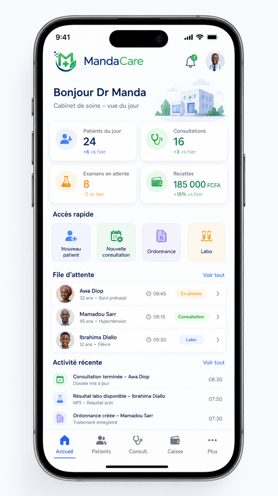
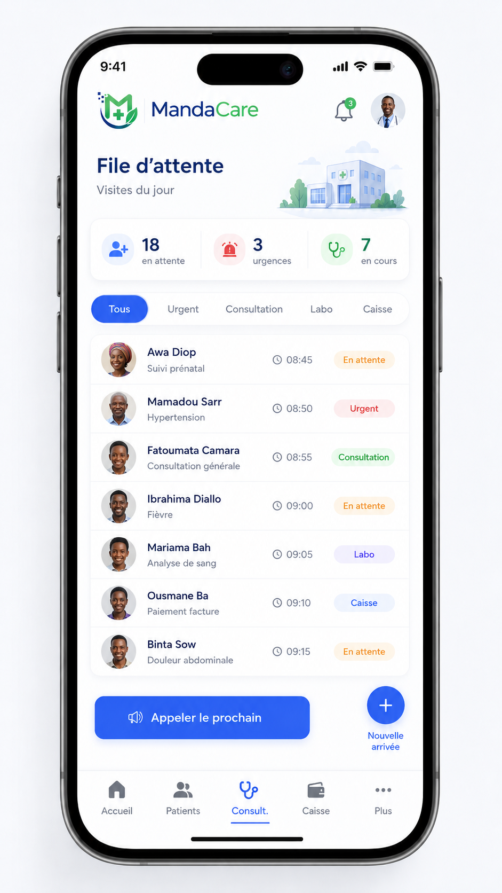
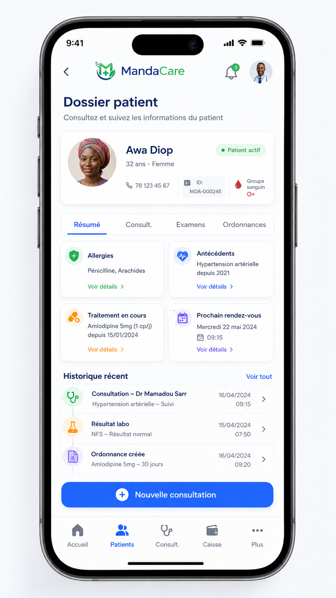
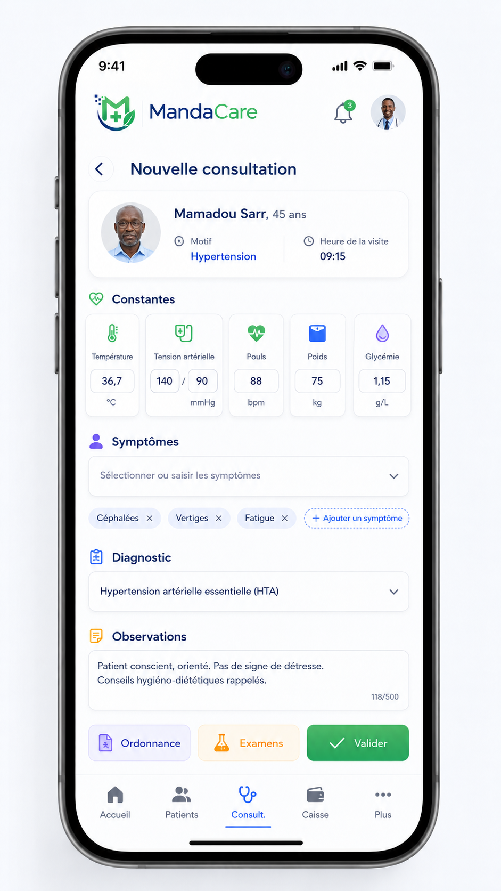
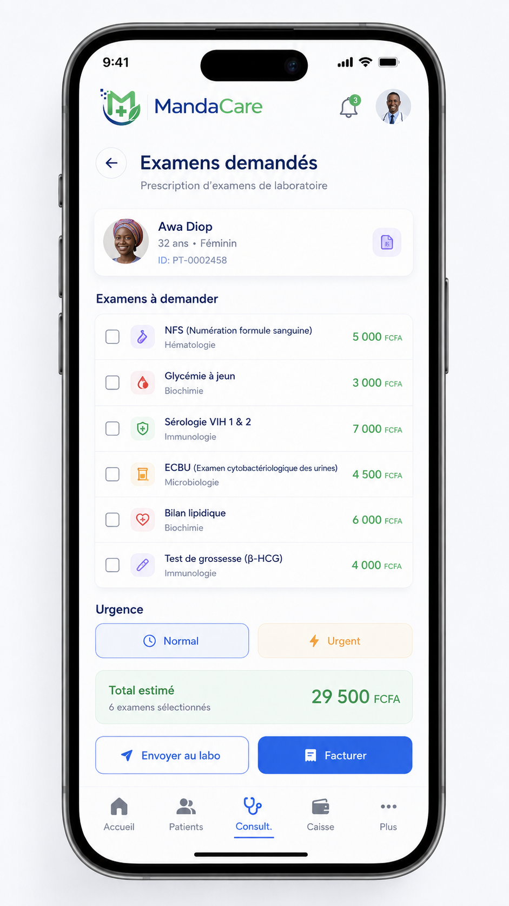
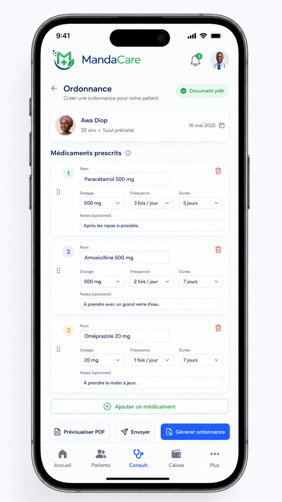
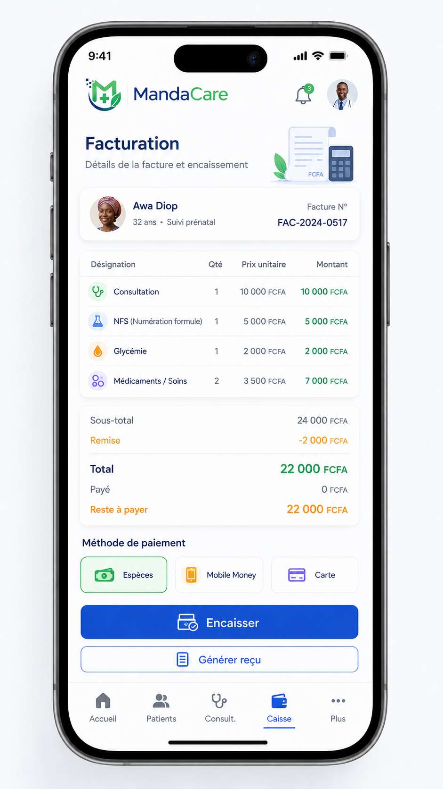
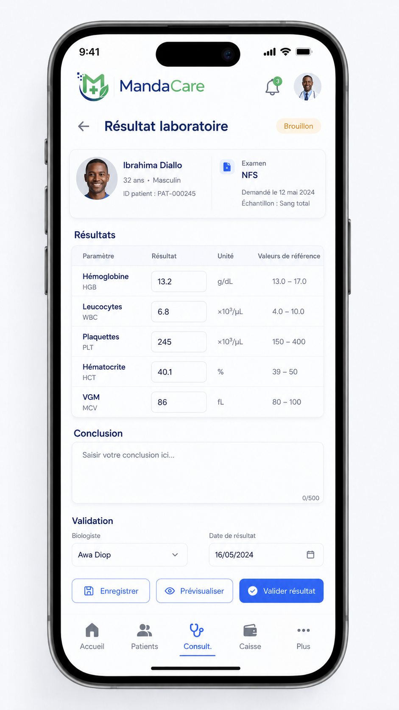
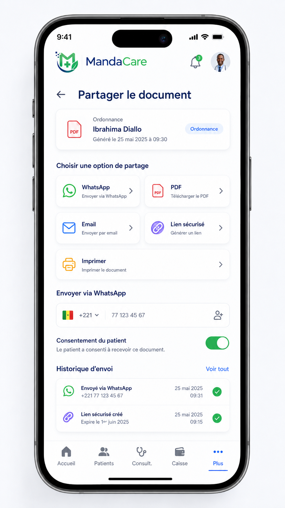

# Guide d'Exploitation de l'Application Mobile MandaCare (v1)

Ce guide est destiné aux utilisateurs de l'application mobile et tablette **MandaCare**. Il explique comment naviguer dans l'application et réaliser toutes les opérations cliniques et administratives quotidiennes du centre de santé.

---

## 1. Principes de Design et Rôles Utilisateurs

L'application MandaCare propose une interface fluide et moderne adaptée aux smartphones et tablettes :
* **Charte graphique** : L'interface utilise une palette de couleurs soignée :
  * Vert Médical (`#0E7C66`) : Raccourcis, validations et succès.
  * Bleu Santé Profond (`#0B3D5C`) : Navigation, en-têtes et textes principaux.
  * Or Premium (`#D4A94F`) : Tarifs et indicateurs financiers.
  * Gris et bordures (`#D0D5DD`, `#667085`) : Pour la neutralité des champs.
  * Couleurs de statut : Vert (`#12B76A`) pour les succès/sorties, Orange (`#F79009`) pour les alertes/attentes, Rouge (`#D92D20`) pour les urgences, Bleu (`#2E90FA`) pour les informations/consultations en cours.
* **Confirmations explicites** : Pour la sécurité médicale, toute action sensible (validation de paiement, enregistrement de constantes ou consultation, envoi de rapports) nécessite une validation ou demande de confirmation.
* **Contrôle d'accès par rôle** : Les fonctionnalités sont activées ou masquées dynamiquement sur le menu en fonction du rôle du compte connecté :
  * **Médecin (MEDECIN)** / **Infirmier (INFIRMIER)** : Saisie des constantes, des consultations, ordonnances, orientation vers la caisse ou le laboratoire.
  * **Caissier (CAISSIER)** : Accès au module Caisse, facturation et validation des paiements.
  * **Laborantin (LABORATOIRE)** : Saisie des résultats d'analyses médicales.
  * **Administrateur (ADMIN)** : Accès complet (Gestion de l'équipe, Grille tarifaire, Pharmacie, Rapports).

---

## 2. Authentification et Connexion

Pour accéder à MandaCare, vous devez d'abord vous connecter :
1. Saisissez votre **Nom d'utilisateur**.
2. Saisissez votre **Mot de passe** (utilisez l'icône d'œil à droite du champ pour afficher ou masquer la saisie).
3. Cliquez sur **Se connecter** :
   * En cas de succès, vous êtes redirigé vers l'écran d'Accueil.
   * En cas d'erreur (identifiants incorrects ou réseau indisponible), un message d'erreur explicite s'affiche au bas du formulaire.

---

## 3. L'Écran d'Accueil (Tableau de Bord)

L'accueil constitue la vue centrale de l'activité du jour :
* **Indicateurs du jour (KPIs)** : Affichent en temps réel le nombre de patients en attente, en cours de consultation, en attente de paiement à la caisse ou en attente d'analyses au laboratoire.
* **Accès rapide** : Raccourcis pour ajouter un patient, ouvrir la liste des patients, aller aux consultations ou à la caisse.
* **File d'attente du jour** : Liste ordonnée de tous les patients enregistrés aujourd'hui avec leur statut et motif. Vous pouvez actualiser cette liste à tout moment via un geste de tirage vers le bas (**Pull-to-refresh**).
* **Dossier patient** : Appuyez sur n'importe quel patient de la file d'attente pour ouvrir sa fiche détaillée.

---

## 4. Gestion de la Fiche Patient

L'onglet **Patients** permet de gérer le registre clinique :

### 4.1. Recherche et Filtres
* Utilisez la barre de recherche en haut de l'écran pour retrouver un patient par son **nom**, son **téléphone**, son **numéro de dossier**, son **motif d'arrivée** ou son **statut**.
* Filtrez la liste via la barre de filtres rapide : **Tous**, **Attente**, **Urgents** (priorité haute), **Caisse**, **Labo**.

### 4.2. Enregistrement d'un Nouveau Patient
Cliquez sur le bouton **"+"** (ou l'icône de création) pour ouvrir le formulaire :
1. **Identité** : Saisissez le **Nom complet** (doit comporter au moins un prénom et un nom séparés par un espace), l'**Âge** (obligatoirement entre 0 et 130 ans), le **Sexe** (sélection F ou M) et le numéro de **Téléphone** principal.
2. **Contact & Prise en charge** : Saisissez l'**Adresse**, le numéro de **Contact d'urgence** et le niveau de **Priorité** (Standard, Surveillance, Urgent).
3. **Motif d'arrivée** : Renseignez le motif médical de la venue.
4. Cliquez sur **Enregistrer patient**. Une fois enregistré en base, l'application vous propose d'ouvrir directement sa fiche pour débuter le workflow clinique.

### 4.3. Navigation dans la Fiche Patient (Profil et Parcours)
Lorsqu'un patient est sélectionné, sa fiche affiche :
* Ses informations démographiques et son statut actuel.
* **Le workflow stepper** : Un indicateur visuel des étapes de la visite en cours :
  `Visite ➔ Constantes ➔ Consultation ➔ Caisse ➔ Laboratoire`
  *Vous pouvez cliquer sur chaque étape pour y accéder rapidement.*
* **Historique des visites** : Liste chronologique de toutes les visites du patient. Chaque visite affiche l'icône du service, le diagnostic ou les constantes prises, et un accès aux documents générés (Ordonnance, Reçu, Compte-rendu d'examen).

---

## 5. Parcours Clinique et Constantes (Infirmier / Médecin)

La prise de constantes constitue la deuxième étape du parcours patient :
1. Ouvrez la fiche du patient concerné et cliquez sur **Saisir les constantes** (ou tapez sur l'étape correspondante du stepper).
2. Renseignez les signes vitaux :
   * **Température** : Validée entre 30 et 45 °C.
   * **Pression Artérielle** : Saisissez la valeur **Systolique** (entre 50 et 260 mmHg) et **Diastolique** (entre 30 et 160 mmHg).
   * **Pouls (Fréquence cardiaque)** : Entre 20 et 240 battements/minute.
   * **Saturation en oxygène (SpO2)** : Entre 50 et 100 %.
   * **Fréquence respiratoire** : Entre 5 et 80 cycles/minute.
3. Renseignez les mesures physiques :
   * **Poids** (en kg, entre 1 et 300 kg).
   * **Taille** (en cm, entre 30 et 250 cm).
   * **IMC (Indice de Masse Corporelle)** : Calculé automatiquement en temps réel dès que le poids et la taille sont saisis selon la formule :
     $$\text{IMC} = \frac{\text{Poids (kg)}}{\left(\frac{\text{Taille (cm)}}{100}\right)^2}$$
     L'IMC est affiché dans un encadré vert informatif.
   * **Glycémie** : Entre 0.10 et 999.99.
4. Cliquez sur **Enregistrer** pour sauvegarder. Le patient passe automatiquement au statut **"Consultation"** dans la file d'attente.

---

## 6. La Consultation et l'Ordonnance (Médecin)

Le médecin prend en charge le patient depuis l'onglet **Consult.** ou depuis la fiche patient.

### 6.1. Fiche d'Observation et de Diagnostic
Le formulaire comprend trois sections principales :
1. **Observation clinique** : Saisissez les **Symptômes et plaintes** du patient ainsi que les résultats de l'**Examen clinique** (champs obligatoires).
2. **Conclusion** : Saisissez le **Diagnostic** (obligatoire) et la **Conduite à tenir** (conseils, rendez-vous).
3. **Ordonnance médicale (Rx)** :
   * Cliquez sur **Ajouter un médicament** pour chaque ligne de prescription.
   * Saisissez le **Nom du médicament** (requis) et complétez les informations : **Forme** (comprimé, sirop…), **Dosage** (500mg, 1g…), **Fréquence** (3x/jour…), **Durée** (5 jours…), **Boîtes** (nombre entier) et **Instructions** (ex: après les repas).
   * Vous pouvez supprimer une ligne de prescription à tout moment via l'icône de corbeille rouge.

### 6.2. Décision d'Orientation
Sélectionnez l'orientation du patient à la fin de la consultation :
* **Garder en consultation** : Le patient reste en observation.
* **Libérer le patient** : Il est orienté vers la sortie (via un passage en caisse si des prestations sont facturables).
* **Envoyer au laboratoire** :
   * Une section de prescription d'examens apparaît.
   * Saisissez le nom de l'examen dans la barre de recherche (ex: NFS, Glycémie).
   * Cochez les examens demandés dans le catalogue. Les examens sélectionnés s'affichent sous forme de badges verts et seront facturés à la caisse.

### 6.3. Sauvegarde et Validation
* **Enregistrer en Brouillon** : Permet de sauvegarder vos saisies sans verrouiller le dossier ni rediriger le patient.
* **Valider la consultation** : Verrouille définitivement le dossier clinique pour cette étape et oriente le patient vers la caisse.
  * Si une ordonnance a été rédigée, un message vous propose de **Prévisualiser** le document PDF.

### 6.4. Modification après validation
Si une consultation validée doit être corrigée :
1. Cliquez sur **Modifier la consultation**.
2. Un dialogue s'ouvre, vous obligeant à **saisir un motif de correction**.
3. Une fois le motif renseigné et confirmé, le dossier est déverrouillé pour modification. Les modifications sont historisées sur le serveur pour des raisons d'audit médical.

---

## 7. La Caisse et Facturation (Caissier / Administrateur)

Le caissier gère les dossiers depuis l'onglet **Caisse**.

### 7.1. File d'attente de la Caisse
* Cet écran affiche les patients orientés par la consultation avec le montant total à percevoir et leur orientation cible (**vers labo** ou **vers sortie**).
* Des compteurs synthétiques (KPIs) en haut de l'écran affichent le nombre total de dossiers en caisse, le nombre orienté vers le laboratoire et le nombre orienté vers la sortie.

### 7.2. Encaissement et Règlement
1. Cliquez sur **Encaisser** sur la carte du patient pour ouvrir la feuille de paiement.
2. **Détail des prestations** : L'application affiche la liste détaillée des prestations (actes de soins ou examens prescrits) avec leurs prix unitaires et quantités. Le **Total net à payer** est mis en évidence.
3. Saisissez le **Montant encaissé** :
   * L'application pré-remplit le montant total exact.
   * En cas de modification manuelle du montant saisi, l'application affiche un retour visuel dynamique :
     * **Compte juste** : Si le montant correspond exactement.
     * **Paiement partiel** : Affiche en orange le reste à payer dû par le patient.
     * **Sur-paiement** : Affiche en bleu la monnaie exacte à rendre au patient.
4. Sélectionnez le **Mode de paiement** : Espèces, Mobile Money, Carte bancaire ou Virement.
5. Saisissez une **Référence / reçu** (ex: numéro de transaction mobile money ou numéro de chèque).
6. Cliquez sur **Encaisser et orienter** :
   * Le paiement est enregistré et le patient est orienté vers l'étape suivante (Labo ou Sorti).
   * Un dialogue s'affiche pour **Prévisualiser** ou **Imprimer** le reçu de paiement généré sous format PDF.

### 7.3. Retour en consultation avant paiement
Si le caissier constate une erreur dans les examens prescrits ou la tarification, il peut cliquer sur le bouton **Revenir en consultation**. Après confirmation, le patient est replacé en attente de consultation pour permettre au médecin de corriger sa fiche d'examen avant tout encaissement.

---

## 8. Saisie des Examens de Laboratoire (Laborantin)

Les examens payés à la caisse sont traités par le laborantin :
1. Accédez à la fiche du patient orienté vers le laboratoire.
2. Cliquez sur **Saisir les résultats labo**.
3. **Fiche d'examen** : Un encadré récapitule tous les examens prescrits et réglés en caisse pour cette visite.
4. Renseignez la **Date et heure de prélèvement**.
5. Pour chaque examen listé :
   * Saisissez le résultat de l'analyse dans le champ dédié.
   * Si l'analyse est normale, vous pouvez cocher le commutateur **"Normal"** : le champ de texte se désactive et affiche par défaut "Résultats normaux" sur un fond vert pour un gain de temps.
6. Renseignez d'éventuelles **Notes / Observations** complémentaires.
7. Cliquez sur **Valider et renvoyer en consultation** :
   * Un dossier d'analyse unique est généré sous le format : `LAB-[NuméroPatient]-[AAAAMMJJ]`.
   * Un dialogue s'ouvre pour vous propose de **Prévisualiser** le compte-rendu d'examen médical PDF.
   * Le patient est renvoyé vers le médecin pour l'interprétation finale des résultats.

---

## 9. Le Panneau d'Administration (Plus)

L'onglet **Plus** regroupe la configuration globale de la clinique (accessible selon les droits d'accès).

### 9.1. Stock Pharmacie
Permet de suivre le catalogue de médicaments disponibles au centre :
* **Ajout d'un médicament** (Rôle Admin/Médecin) : Cliquez sur l'icône "+" et renseignez le **Code** (identifiant unique court en majuscules), le **Nom**, le **Dosage**, le **Prix de vente** en FCFA et le **Seuil d'alerte** de stock minimal.
* **Alerte stock critique** : Les médicaments dont le stock descend sous le seuil d'alerte configuré affichent un badge rouge "Stock critique !".
* **Ajustement de stock** : Cliquez sur un médicament de la liste pour modifier son stock physique. Saisissez la quantité d'unités à ajouter ou à retirer (valeur négative, ex: `-5` pour enregistrer une perte ou une sortie) et le **motif de l'ajustement** (obligatoire).

### 9.2. Rapports & Pilotage
Fournit un aperçu chiffré de l'activité journalière :
* Recettes totales cumulées aujourd'hui.
* Répartition graphique et chiffrée des patients par état (attente, consultation, caisse, labo, sorti).
* Recettes détaillées par mode de paiement (espèces, mobile money, etc.) avec barre de progression en pourcentage.
* Top 5 des examens les plus prescrits aujourd'hui avec leur volume.

### 9.3. Gestion de l'Équipe (Rôle Admin)
Permet de gérer les comptes des collaborateurs de la clinique :
* **Créer / Modifier un collaborateur** : Renseignez le **Prénom**, le **Nom**, le **Téléphone**, l'**Email**, le **Profil** (Admin, Médecin, Infirmier, Caissier, Laboratoire, Accueil), le **Nom d'utilisateur** et le **Mot de passe** (requis à la création, optionnel à la modification).
* **Activation/Désactivation** : Le commutateur **"Compte actif"** permet de suspendre instantanément l'accès d'un collaborateur à l'application sans supprimer ses données historiques.

### 9.4. Grille Tarifaire (Rôle Admin)
Permet de définir les prix appliqués au sein du centre :
* Les tarifs sont divisés en deux onglets : **Examens de laboratoire** et **Actes de soins**.
* Les actes sont regroupés par catégories rétractables (ex: BIOCHIMIE, ACTE INFIRMIER).
* **Ajout / Modification d'un tarif** : Renseignez le **Code unique** (non modifiable après création), la **Désignation**, la **Catégorie** (sélectionnez une catégorie existante ou créez-en une nouvelle en saisissant son nom) et le **Prix en FCFA** (nombre entier).
* Le commutateur **"Acte actif"** permet de masquer temporairement un acte du catalogue sans le supprimer, le rendant indisponible lors des consultations et de la facturation.

### 9.5. Clinique (Paramètres Officiels)
Affiche les informations officielles de la clinique chargées depuis le serveur : **Nom du centre**, **Slogan / Devise** et **Ville / Quartier**. Ces données sont automatiquement incluses dans l'en-tête de tous les documents officiels générés (ordonnances, reçus, comptes-rendus).

### 9.6. Support technique
En cas de dysfonctionnement de l'application mobile :
1. Cliquez sur **Support** puis sur l'icône de création de ticket.
2. Renseignez le **Sujet**, la **Catégorie** (Bug, Question ou Demande de fonctionnalité), la **Priorité** (Basse, Moyenne, Haute, Urgente) et décrivez précisément le problème rencontré.
3. Cliquez sur **Soumettre**. Vous pouvez suivre l'état de traitement de vos tickets (En cours / Résolu) directement depuis la liste.

---

## 10. Partage de Documents Cliniques (WhatsApp / SMS)

L'application MandaCare intègre un module sécurisé de prévisualisation et de partage de documents médicaux (`DocumentPreviewShareScreen`) :
* **Documents concernés** : Ordonnances médicales, reçus de paiement de caisse et comptes-rendus d'examens de laboratoire.
* **Prévisualisation** : Avant tout partage, le document PDF s'affiche à l'écran pour vérification visuelle de la mise en page.
* **Envoi WhatsApp** : Vous pouvez cliquer sur le bouton de partage pour envoyer automatiquement le PDF ou son lien direct au patient via WhatsApp. Le numéro de téléphone du patient est pré-rempli s'il a été renseigné lors de son admission.

